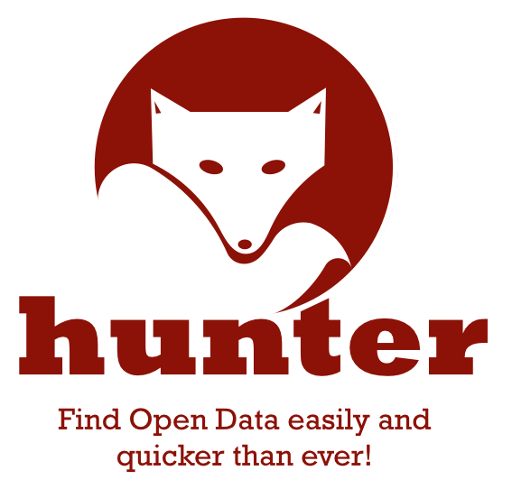
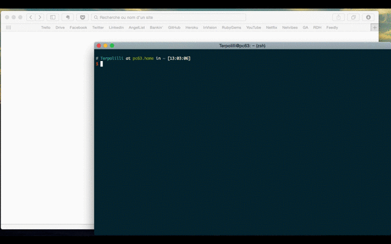

# hunter-api

## Version

0.2.0

## Prerequisites

You will need [Leiningen][1] 1.7.0 or above installed.

[1]: https://github.com/technomancy/leiningen

## Running

### app
To start a web server for the application, run:

    lein ring server

## License

Copyright © 2014 Raw Data Hunter - Nicolas Terpolilli

# Data Hunter - Value Proposition

Find open data easily and quicker than ever

## Usage

### Rapidité

Thiel: coeur de la VP = 10x meilleur que les concurrents

=> réponse doit être 10x plus rapide qu'une recherche de jeux de données à la main que ce soit sur les sites classiques ou sur les concurrents

5 minutes -> 30 secondes

4 minutes -> 24 secondes

3 miuntes -> 18 secondes

2 minutes -> 12 secondes

### Simplicité

Power Law / Pareto
=> 20% des datasets représentent 80% des jeux de données cherchés / réutilisés
* commment déterminer quels sont ces 20% de jeux de données?
  * Parser les réutilisations
  * déterminer quels sont les jeux de données les plus important
  * apprendre de ce que recherchent les utilisateurs
* que faire quand quelqu'un cherche un ds non indexé?

## Concurrence

* Quandl
* enigma.io
* Google
* Sites Open Data
* Data Catalog
* OKFN
